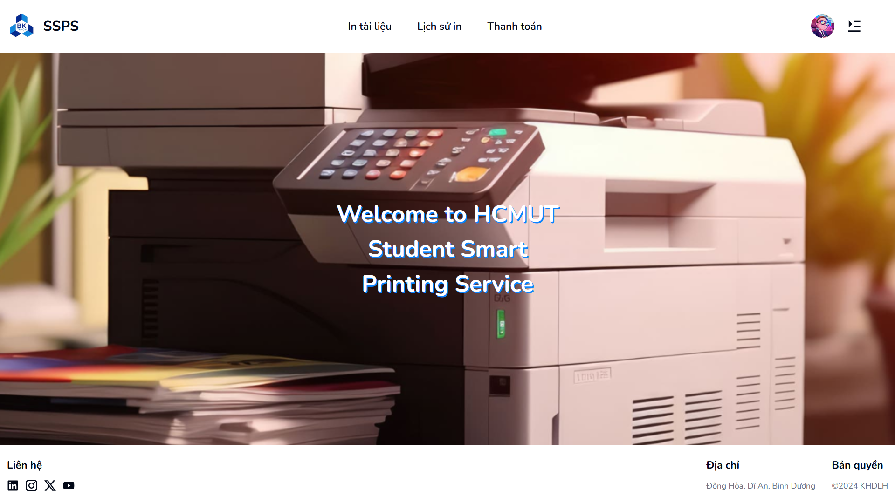

# CNPM_HCMUT_SSPS



## Giới thiệu

**HCMUT_SSPS** là một dịch vụ in ấn thông minh dành cho sinh viên Đại học Bách khoa TP.HCM (HCMUT), giúp việc sử dụng các thiết bị in trong trường trở nên hiệu quả hơn. Sinh viên có thể sử dụng hệ thống này để đặt trước nhu cầu in ấn của mình mà không cần phải chờ đợi xếp hàng theo phương pháp truyền thống.

Hệ thống còn cung cấp tính năng lưu trữ thông tin in ấn, chẳng hạn như: tài liệu, số lượng, ngày, giờ, địa điểm... của từng đơn hàng. Sinh viên có thể xem lại toàn bộ chi tiết về lịch sử sử dụng hệ thống.

Hệ thống được quản lý bởi Nhân viên Dịch vụ In ấn Sinh viên (SPSO). Họ chịu trách nhiệm cấu hình hệ thống, quản lý máy in và xem các thống kê, hiệu suất của HCMUT_SSPS. SPSO cũng có thể xem lịch sử in ấn của người dùng.

## Công nghệ sử dụng

- **Front-end**:
  - Quản lý global state: react-query.
  - Build tool: vite (reactJS).
  - CSS library: tailwind, shadcnUI.
- **Back-end**:
  - NodeJS framework: expressJS.
  - Database: supabase (prisma postgresql).

## Cài đặt

Trước khi khởi chạy dự án:

- Cài đặt nodejs: [https://nodejs.org/en](https://nodejs.org/en)
- Cài đặt quản lý gói: [https://www.npmjs.com/](https://www.npmjs.com/)

### Back end

- Di chuyển vào thư mục server: `cd server`.
- Tải các gói cần thiết: `npm install`.
- Cài đặt database trên supabase tích hợp cho prisma: [https://www.prisma.io/docs/orm/overview/databases/supabase#what-is-supabase](https://www.prisma.io/docs/orm/overview/databases/supabase#what-is-supabase).
- Cài đặt storage cho upload file trên supabase: [https://supabase.com/docs/guides/storage/quickstart?queryGroups=language&language=javascript](https://supabase.com/docs/guides/storage/quickstart?queryGroups=language&language=javascript).
- Tạo file `.env` và điền các thông tin trong thư mục hiện tại:

```env
# This was inserted by `prisma init`:
# Environment variables declared in this file are automatically made available to Prisma.
# See the documentation for more detail: https://pris.ly/d/prisma-schema#accessing-environment-variables-from-the-schema

# Prisma supports the native connection string format for PostgreSQL, MySQL, SQLite, SQL Server, MongoDB and CockroachDB.
# See the documentation for all the connection string options: https://pris.ly/d/connection-strings

# Connect to Supabase via connection pooling with Supavisor.
DATABASE_URL=

# Direct connection to the database. Used for migrations.
DIRECT_URL=

ACCESS_TOKEN_SECRET_SIGNATURE=
REFRESH_TOKEN_SECRET_SIGNATURE=

SUPABASE_URL=
SUPABASE_KEY=
```

- Để ánh xạ mô hình dữ liệu tới lược đồ cơ sở dữ liệu, cần sử dụng CLI command: `npx prisma migrate dev --name init`

- Khởi động back end: `npm run dev`, server sẽ chạy trên địa chỉ: `http://localhost:5000`.

### Front end

- Di chuyển vào thư mục server: `cd client`.
- Tải các gói cần thiết: `npm install`.
- Tạo file `.env` trong thư mục hiện tại:

```env
VITE_BACK_END_URL="http://localhost:5000/api"
VITE_FRONT_END_URL="http://localhost:5173"
```

- Khởi động front end: `npm run dev`, client sẽ chạy trên địa chỉ `http://localhost:5173`.

## Đạt được

- Quy trình hoạt động mô tả đầy đủ các thiết kế diagram.
- Giao diện ứng dụng dễ nhìn, dễ sử dụng.

## Hạn chế

- Chưa tích hợp phương thức thanh toán.
- Cần cải thiện chức năng báo cáo hệ thống.

## Thành viên

- Đoàn Trí Hùng - 2211322
- Quách Thanh Điền -  2210754
- Lê Nguyễn Tường Linh - 2211850
- Lê Bá Khánh - 2211509
- Hoàng Minh Hiếu - 2210986

## Tài liệu

- [Capstone_Project_Autumn_2023.pdf](/docs/Capstone_Project_Autumn_2023.pdf)
- [Slide thuyết trình](/docs/CNPM.pptx)
- Link youtube demo: [https://www.youtube.com/watch?v=taPRHFg6Jno](https://www.youtube.com/watch?v=taPRHFg6Jno)
